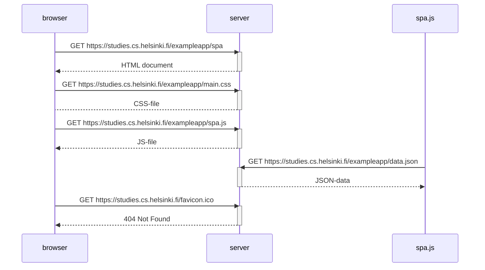

SPA

```mermaid
sequenceDiagram
participant browser
participant server
participant spa.js

browser->>server: GET https://studies.cs.helsinki.fi/exampleapp/spa
activate server
server-->>browser: HTML document
deactivate server

browser->>server: GET https://studies.cs.helsinki.fi/exampleapp/main.css
activate server
server-->browser: CSS-file
deactivate server

browser->>server: GET https://studies.cs.helsinki.fi/exampleapp/spa.js
activate server
server-->>browser: JS-file
deactivate server

spa.js->>server: GET https://studies.cs.helsinki.fi/exampleapp/data.json
activate server
server-->>spa.js: JSON-data
deactivate server

browser->>server: GET https://studies.cs.helsinki.fi/favicon.ico
activate server
server-->>browser: 404 Not Found
deactivate server
```
